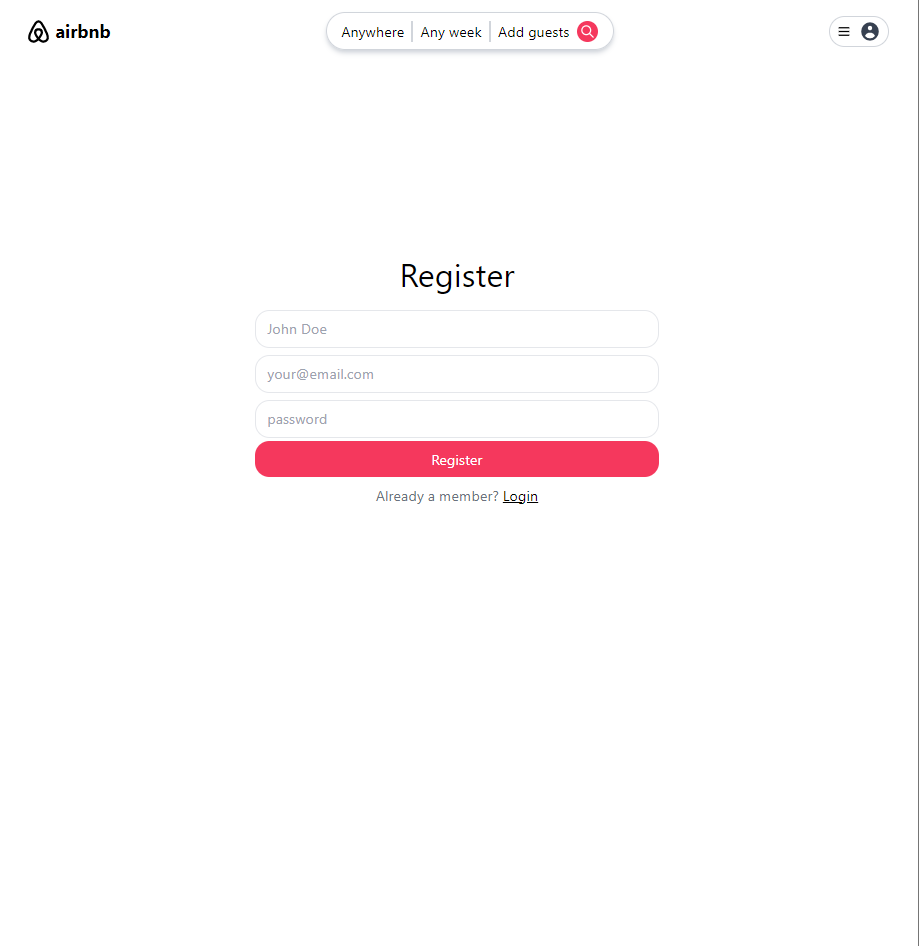
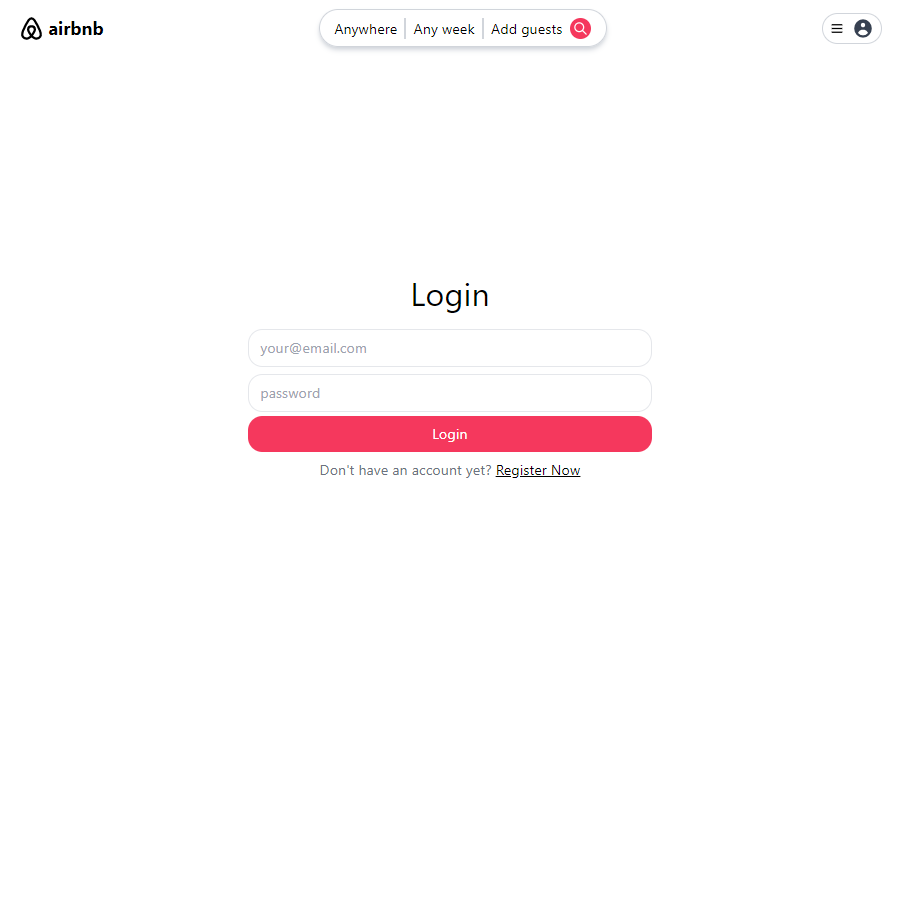
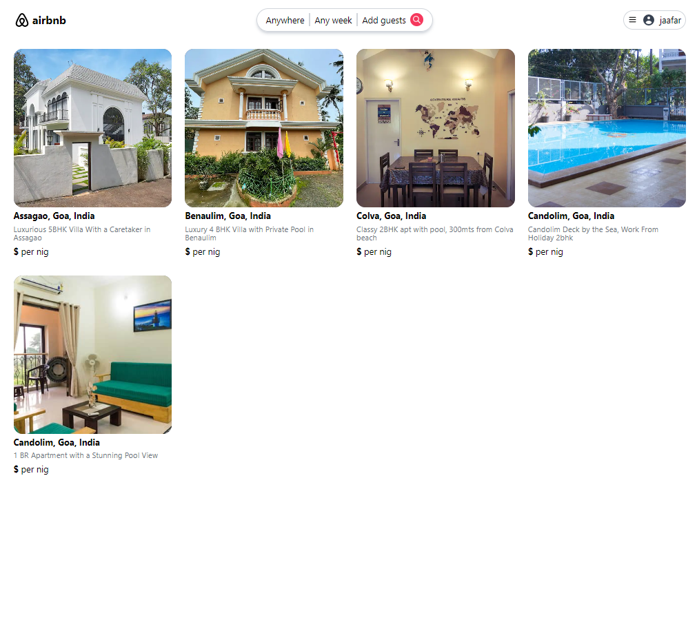
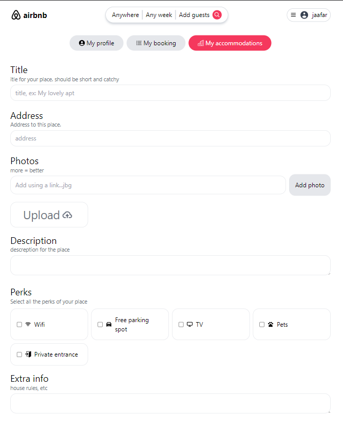
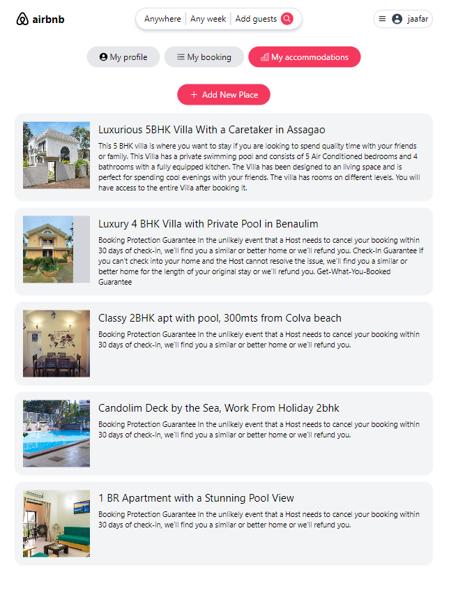
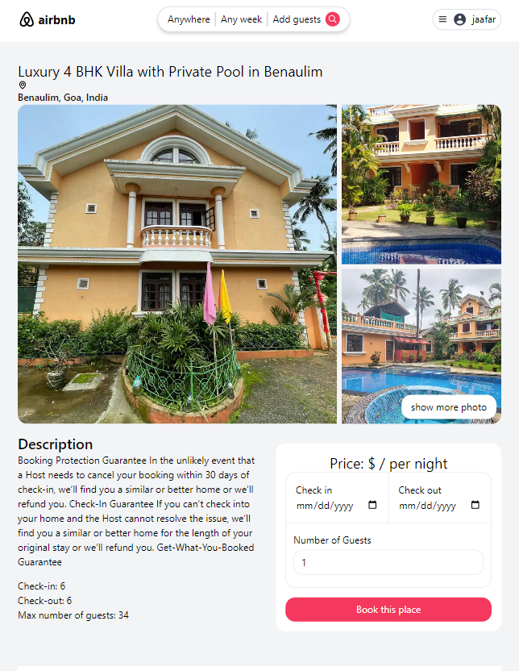

# Airbnb website using React 18! (MERN stack)

Build and Deploy Airbnb website website using React 18! where you will be able to sign in in and sign out using email and password Authentication, create, book  and discover places.

## Welcome! 
Thanks for checking out this Application.

## Overview

### Links
- Live Site URL => Not Deployed yet

## My process

### Built with

- React Js
- Node js
- Express
- mongooDB
- contextApi
- react router dom
- tailwind css
- JavaScript
- JSX

## Author

- Linkedin - [@jaafar youssef](https://www.linkedin.com/in/jaafar-youssef-923100249/)

jaafar youssef
